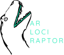

+++
title = "Home"
weight = 0
+++

Flexible, arbitrary-scenario, uncertainty-aware variant calling   with parameter free filtration via FDR control.

### Key features

* Calls SNVs, MNVs, indels, arbitrary replacements, inversions, duplications, haplotype blocks (combinations of any of the previous), and breakends.
* Supports all length ranges (from small to structural) with a unified statistical model.
* The statistical model entails all possible sources of uncertainty (mapping, typing, heterogeneity) and biases (strand, read pair orientation, read position, sampling, contamination, homologous regions).
* Resulting variant calls can be filtered by false discovery rate. No parameter tuning necessary.
* Maximum a posteriori allele frequency estimates are provided with each call.

### Calling modes

* Generic, grammar based configuration of the statistical model, allowing to call variants for arbitrary scenarios (including germline, tumor/normal/relapse, pedigrees, FFPE data, and anything else).
* Tumor-normal-calling, classifying variants as somatic in tumor, somatic in normal, germline, or absent.

---

